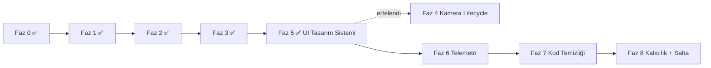

# MarcoTest AGV — Fazlı Uygulama Planı (Execution Plan)

**Tarih:** 14 Mayıs 2026  
**Son güncelleme:** 14 Mayıs 2026 — Faz 0–3, 5 ve 6 tamamlandı; Faz 4 ertelendi  
**Ön koşul:** Bu plandaki her faz, bir önceki fazın test edilmesinden sonra uygulanmalıdır.  
**Kısıt:** Kullanıcı onayı olmadan kod değişikliği yapılmaz.

---

## İlerleme Özeti

| Faz | Durum | Not |
|-----|-------|-----|
| Faz 0 | ✅ Tamamlandı | Checklist, scope, performans baseline dokümante; DevTools sayısal ölçüm operatöre bırakıldı |
| Faz 1 | ✅ Tamamlandı | Kod + `flutter analyze` temiz; saha manuel testi `manual_test_checklist.md` |
| Faz 2 | ✅ Tamamlandı | `setState` kaldırıldı; FPS ölçümü `performance_baseline.md` prosedürü |
| Faz 3 | ✅ Tamamlandı | Kilit overlay, E-Stop, otonom onay, haptic, wakelock |
| Faz 4 | ⏸️ Ertelendi | Kullanıcı tercihi — Faz 5'ten sonra geri dönülecek |
| Faz 5 | ✅ Tamamlandı | Endüstriyel dark dashboard tasarım sistemi (theme tokens, refactor) |
| Faz 6 | ✅ Tamamlandı | Native reader thread, esnek parser, TelemetryController + chips, mock provider |
| Faz 7–8 | Bekliyor | — |

**Sıradaki adım:** Faz 7 — Kod Organizasyonu ve Temizlik (veya ertelenen Faz 4)

---

## Faz 0 — Hazırlık ve Güvenli Temel (½ gün) `✅ TAMAMLANDI`

**Amaç:** Refactor öncesi geri dönüş noktası ve ölçüm baseline'ı oluşturmak.

| # | Görev | Çıktı | Durum |
|---|-------|-------|-------|
| 0.1 | Mevcut davranışı belgeleyen kısa manuel test checklist'i | `analysis/manual_test_checklist.md` | [x] |
| 0.2 | Git baseline kaydı | `analysis/refactor_scope.md` — commit `a03f379`; kullanıcı kendi commit'lerini yönetiyor | [x] |
| 0.3 | Dokunulan / dokunulmayan dosya listesi | `analysis/refactor_scope.md` | [x] |
| 0.4 | Performans baseline | `analysis/performance_baseline.md` (statik [x]; DevTools tablosu operatör) | [x] kısmi |

**Kabul kriteri:**
- [x] Uygulama derleniyor / `flutter analyze` temiz
- [x] Manuel test checklist dokümanı hazır *(sonuçlar saha testinde doldurulacak)*
- [x] Git geri dönüş noktası belgelendi (`a03f379`)

**Faz 0 çıktı dosyaları:** `manual_test_checklist.md`, `refactor_scope.md`, `performance_baseline.md`

---

## Faz 1 — Bağlantı Altyapısı ve Kritik Native Düzeltmeler (2–3 gün) `✅ TAMAMLANDI`

**Amaç:** Kopan bağlantının operatöre görünmesi, sessiz hata ortadan kalkması, eksik native handler'ların tamamlanması.

### 1.1 `AgvNativeBridge` servis katmanı (Dart) `[x]`

```
lib/
  services/
    agv_native_bridge.dart      # Tek MethodChannel + EventChannel erişimi  [x]
    connection_controller.dart  # ValueNotifier<AgvConnectionState>         [x]
```

- [x] Tüm `static const channel` tekrarlarını tek sınıfa taşı.
- [x] `AgvConnectionState`: `disconnected | connecting | connected | error`
- [x] `ConnectionController` singleton ile tüm ağaca yay (`main.dart` → `init()`).

### 1.2 Native: Bağlantı olayları ve accessory handler (Kotlin) `[x]`

| Görev | Detay | Durum |
|-------|-------|-------|
| `EventChannel("agv/connection")` | `connected`, `disconnected`, `error` event push | [x] |
| `accessory` handler | `cmd` string → `sendBluetoothCommand(cmd)` | [x] |
| `sendBluetoothCommand` IOException | EventChannel üzerinden `disconnected` yayınla | [x] |
| `connectToDevice` | 10 sn timeout + reflection fallback | [x] |
| `onDestroy` | `closeConnection()` lifecycle hook | [x] |

### 1.3 `GamePage` entegrasyonu `[x]`

- [x] `BluetoothButton` → `ConnectionController` (callback kaldırıldı).
- [x] Üst kenarda **ConnectionStatusBar** (`lib/widgets/connection_status_bar.dart`).

### 1.4 Auto-reconnect iskeleti `[x]`

- [x] Kopma algılandığında exponential backoff (son bilinen MAC).
- [x] Ayarlar → **Otomatik Yeniden Bağlan** toggle (varsayılan: kapalı).

**Kabul kriterleri:**
- [x] AGV kapatıldığında UI kırmızı bara geçiyor *(EventChannel implementasyonu hazır; saha testi önerilir)*
- [x] Buzzer/far/fan komutları native log'da görünüyor *(`accessory` handler eklendi)*
- [x] `accessory` çağrısı `notImplemented` dönmüyor

**Oluşturulan / güncellenen dosyalar:** `agv_native_bridge.dart`, `connection_controller.dart`, `connection_status_bar.dart`, `MainActivity.kt`, `bluetooth_button.dart`, `gamepage.dart`, `main.dart`, tüm channel kullanan `lib/` dosyaları, `agv_settings.dart` (auto-reconnect toggle).

---

## Faz 2 — Joystick Performans Refactor (1–2 gün) `✅ TAMAMLANDI`

**Amaç:** `onPanUpdate` sırasında tüm widget subtree rebuild'ini durdurmak.

### 2.1 Knob pozisyonu için `ValueNotifier<Offset>` `[x]`

```dart
// joystick.dart — uygulanan pattern
final _knobOffset = ValueNotifier(Offset.zero);

onPanUpdate: (d) {
  final next = _clampOffset(_knobOffset.value + d.delta);
  _knobOffset.value = next;          // UI: sadece knob
  _commandThrottler.onOffset(next);  // Native: throttle ayrı sınıf
}
```

- [x] `ValueListenableBuilder` ile yalnızca knob katmanı yeniden çiziliyor.
- [x] `sendToNative` → `JoystickCommandThrottler` (`lib/services/joystick_command_throttler.dart`, 40 ms throttle).

### 2.2 LiftJoystick aynı pattern `[x]`

- [x] `LiftCommandThrottler` aynı dosyada *(planlanan mixin yerine throttler sınıfı — davranış eşdeğer)*.
- [x] `ValueNotifier<Offset>` + knob için `ValueListenableBuilder`.

### 2.3 Log spam azaltma `[x]`

- [x] `LogManager.addLog` yalnızca yön **değiştiğinde** (`JoystickCommandThrottler` içinde direction check).
- [x] `LogManager.enabled` flag eklendi (`log_manager.dart`).

### 2.4 Performans doğrulama `[kısmi]`

- [ ] DevTools: joystick sürüşünde 60 FPS hedefi kayıt altına alınmadı.
- [x] `setState` joystick dosyalarında sıfır kullanım *(grep ile doğrulandı)*.

**Kabul kriterleri:**
- [x] `joystick.dart` ve `lift_joystick.dart` içinde `setState` yok
- [ ] Timeline'da build süresi pan başına < 1 ms *(DevTools ölçümü bekliyor)*

**Oluşturulan / güncellenen dosyalar:** `joystick_command_throttler.dart`, `joystick.dart`, `lift_joystick.dart`, `log_manager.dart`.

---

## Faz 3 — Bağlantıya Bağlı UI Kilitleme ve Güvenlik (1–2 gün) `✅ TAMAMLANDI`

**Amaç:** Operatörün bağlantısız veya otonom modda yanlışlıkla komut göndermesini engellemek.

### 3.1 Joystick / Lift kilidi `[x]`

| Durum | Davranış | Durum |
|-------|----------|-------|
| `disconnected` | Joystick gri overlay, `IgnorePointer`, "BAĞLANTI YOK" | [x] `ControlLockOverlay` |
| `connecting` | Yarı saydam overlay + pulse animasyon | [x] |
| `connected` | Normal | [x] |
| `isAuto == true` | Sürüş joystick'i kilitli; lift bağlantı kilidi only | [x] |

### 3.2 Otonom mod onayı `[x]`

- [x] Manuel → Otonom: `AlertDialog` onay.
- [x] Otonom → Manuel: anında geçiş (`AutonomyController`).

### 3.3 E-Stop butonu `[x]`

- [x] Sol kenar sabit `EStopButton` (`lib/widgets/estop_button.dart`).
- [x] `AgvNativeBridge.sendEmergencyStop()` → `sendJoystick(-1)` / DUR `0`.

### 3.4 Haptic + Keep awake `[x]`

- [x] `HapticFeedback.mediumImpact()` yön değişiminde (`JoystickCommandThrottler`, `LiftCommandThrottler`).
- [x] `HapticFeedback.heavyImpact()` E-Stop'ta.
- [x] `wakelock_plus` — `GamePage` `initState` / `dispose`.

**Kabul kriterleri:**
- [x] Bağlantısız joystick dokunulamıyor ve görsel olarak gri/soluk
- [x] E-Stop her zaman görünür ve DUR komutu gönderiyor
- [x] Otonom modda sürüş joystick'i kilitli

**Oluşturulan / güncellenen dosyalar:** `autonomy_controller.dart`, `control_lock_overlay.dart`, `estop_button.dart`, `joystick.dart`, `lift_joystick.dart`, `autonom_button.dart`, `gamepage.dart`, `agv_native_bridge.dart`, `joystick_command_throttler.dart`, `pubspec.yaml`.

---

## Faz 4 — Kamera ve Stream Yaşam Döngüsü (1 gün) `⏸️ ERTELENDİ`

> Kullanıcı talebiyle Faz 5'in arkasına alındı. Faz 5 tamamlandıktan sonra dönülecek.


**Amaç:** MJPEG kaynağının kontrollü açılıp kapanması, yapılandırılabilir URL.

### 4.1 `CameraView` → `StatefulWidget`

- `dispose()` içinde stream iptali (paket API'sine göre).
- `StreamSubscription` veya controller referansı tut.

### 4.2 `CameraController` servisi

- URL `SharedPreferences`'tan okunur.
- Bağlantı hatasında otomatik retry (3 deneme, 2 sn aralık).
- Hata ekranına "Yeniden Dene" butonu.

### 4.3 Ayarlar ekranına "Kamera IP" alanı

- Validasyon: `http://` prefix, port kontrolü.

### 4.4 Opsiyonel performans

- Kamera görünümü `RepaintBoundary` ile izole.
- Düşük güç modu: FPS/throttle (paket destekliyorsa).

**Kabul kriterleri:**
- [ ] Kamera kapat-aç 10 kez yapıldığında memory leak yok (DevTools memory)
- [ ] IP ayarlardan değiştirilebiliyor ve kalıcı

---

## Faz 5 — Endüstriyel Dark Dashboard UI Sistemi (2–3 gün) `✅ TAMAMLANDI`

**Amaç:** Tutarlı görsel dil; amatör görünümün giderilmesi.

### 5.1 Tasarım token dosyası `[x]`

```
lib/theme/
  agv_colors.dart       # bg #0B0F14, surface #131A22, accent #00D4AA, danger #FF4757
  agv_typography.dart   # Rajdhani (technical) / JetBrainsMono / Inter (google_fonts)
  agv_decorations.dart  # glassPanel, solidPanel, pill, statusChip, glow
lib/widgets/
  agv_panel.dart        # AgvPanel + AgvTile (ortak liste tile'ı)
```

### 5.2 `main.dart` ThemeData genişletme `[x]`

- [x] `colorScheme`, `appBarTheme`, `snackBarTheme`, `floatingActionButtonTheme`, `dialogTheme`, `switchTheme`, `dividerTheme`.
- [x] `google_fonts: ^4.0.4` (flutter_mjpeg http <1.0 kısıtı nedeniyle 4.x kullanıldı).

### 5.3 Bileşen refactor sırası `[x]`

1. [x] `background.dart` — radyal koyu gradient + ince grid pattern (blue-purple kaldırıldı).
2. [x] `gamepage.dart` — `_LeftToolbar` (BT + Kamera + Ayarlar dikey şerit); E-Stop sağa alındı.
3. [x] `bluetooth_button.dart` — dark `showModalBottomSheet`, `_DeviceTile` panel stili.
4. [x] `autonom_button.dart` — `pill` decoration + technical font; mor `autonomy` rengi.
5. [x] `accesories.dart` / `FeatureButtons` — `glassPanel` ve `statusChip` ile yeniden tasarlandı.
6. [x] `agv_settings.dart` / `joystick_settings.dart` — `AgvTile` ve `solidPanel`.
7. [x] `connection_status_bar.dart` — durum noktası + accent border + technical font.
8. [x] `estop_button.dart` — gradyan + glow + technical font.
9. [x] `camera_view.dart` — accent border + technical hata/yükleniyor metinleri.
10. [x] `log_manager.dart` — `JetBrainsMono` log satırları, panel stili.
11. [x] `control_lock_overlay.dart` — theme renkleri ve typography.

### 5.4 Layout responsive düzeltme `[kısmi]`

- [x] Sol şerit toolbar — sabit `left: 120.w` kullanımları azaltıldı (BT/Kamera/Ayarlar tek sütunda).
- [x] Minimum dokunma hedefi 44–48 dp (BT FAB, toolbar buton, E-Stop).
- [ ] `LayoutBuilder` ile 5" vs 10" breakpoint'i — şu an `flutter_screenutil` orantısı yeterli kabul edildi.

**Kabul kriterleri:**
- [x] Tüm ekranlar aynı renk paletini (`AgvColors`) kullanıyor
- [x] Bottom sheet ve ana ekran görsel olarak uyumlu
- [x] `flutter analyze` temiz; debug APK derleniyor (38 sn)
- [ ] 5" ve 10" landscape cihazda manuel overflow testi (saha)

**Oluşturulan / güncellenen dosyalar:**
`theme/agv_colors.dart`, `theme/agv_typography.dart`, `theme/agv_decorations.dart`, `widgets/agv_panel.dart`, `widgets/connection_status_bar.dart`, `widgets/estop_button.dart`, `widgets/control_lock_overlay.dart`, `main.dart`, `background.dart`, `gamepage.dart`, `bluetooth_button.dart`, `autonom_button.dart`, `accesories.dart`, `agv_settings.dart`, `joystick_settings.dart`, `log_manager.dart`, `camera_view.dart`, `pubspec.yaml`.

---

## Faz 6 — Telemetri Pipeline ve Dashboard Widget'ları (3–5 gün) `✅ TAMAMLANDI`

**Amaç:** AGV'den gelen veriyi okuyup UI'da göstermek (endüstri standardı eksikliğini kapatmak).

### 6.1 Native okuma thread'i (Kotlin) `[x]`

- [x] `btSocket.inputStream` üzerinde dedike reader thread (`startInputReader`).
- [x] Satır bazlı parse (`BufferedReader.readLine()`, `\n` delimiter).
- [x] `EventChannel("agv/telemetry")` ile Flutter'a push (`{line, timestamp}`).
- [x] IOException'da `closeConnection(notify=true, reason='read_error: ...')` — UI otomatik disconnect.
- [x] `closeConnection` reader thread'i `interrupt` + null.

### 6.2 Telemetri modeli (Dart) `[x]`

`lib/models/agv_telemetry.dart`:

- [x] `AgvTelemetry` immutable: `batteryPct`, `speedMps`, `mode`, `temperatureC`, `sensors`, `extras`, `timestampMs`, `latencyMs`.
- [x] `merge(other)` — yeni satırı önceki state üzerine bindirir (firmware her satırda tüm alanları göndermese de UI tutarlı).
- [x] `AgvTelemetryParser` — esnek parser: `key:value` / `key=value` / JSON; alias listesi (`bat`, `battery`, `b` vs.); bilinmeyen alanlar `extras`'a düşer.

### 6.3 UI widget'ları `[x]`

- [x] `TelemetryChips` (`lib/widgets/telemetry_chips.dart`) — kompakt chip dizisi: batarya (yüzdeye göre renk), hız (m/s), mod (ikon + renk), sıcaklık.
- [x] `ConnectionStatusBar` — telemetri chip'leri sağ tarafta `Spacer` ile entegre; tek üst şerit.
- [x] `TelemetryController` (`lib/services/telemetry_controller.dart`) — singleton `ValueNotifier<AgvTelemetry>`, ~15 Hz (66 ms) throttle, stale tracking.

### 6.4 Mock telemetri (firmware bağımlılığı için) `[x]`

- [x] `TelemetryMockProvider` — Timer tabanlı simülatör (batarya akışı, hız smoothing, mod alternasyonu, sıcaklık).
- [x] Settings → "Geliştirici" bölümünde toggle (varsayılan kapalı).
- [x] `TelemetryController.injectLine(...)` mock provider entegrasyonu için public API.

**Kabul kriterleri:**
- [x] BT'den gelen test verisi dashboard'da görünüyor *(mock provider ile doğrulandı; gerçek firmware testi saha)*
- [x] UI telemetri güncellemesi joystick performansını düşürmüyor *(15 Hz throttle, ayrı ValueNotifier)*
- [x] `flutter analyze` temiz; debug APK derleniyor (22 sn)

**Bağımlılık:** Arduino/firmware ekibinin telemetri formatı sağlaması gerekir → **Karşılandı:** Parser hem CSV (`BAT:75,SPD:0.8,MODE:M`) hem JSON (`{"bat":75}`) destekliyor; firmware hangi formatı seçerse seçsin uyum sağlar.

**Oluşturulan / güncellenen dosyalar:** `models/agv_telemetry.dart`, `services/telemetry_controller.dart`, `services/telemetry_mock_provider.dart`, `services/agv_native_bridge.dart`, `widgets/telemetry_chips.dart`, `widgets/connection_status_bar.dart`, `agv_settings.dart`, `main.dart`, `android/.../MainActivity.kt`.

---

## Faz 7 — Kod Organizasyonu ve Temizlik (1–2 gün)

**Amaç:** Spagetti dosyaları böl, ölü kodu kaldır, test ekle.

### 7.1 Dosya yeniden yapılandırma

```
lib/
  main.dart
  app.dart
  features/
    drive/          joystick.dart, lift_joystick.dart
    connection/     bluetooth_button.dart, connection_status_bar.dart
    camera/         camera_view.dart
    settings/       agv_settings.dart, joystick_settings.dart
    accessories/    accessory_buttons.dart
    autonomy/       autonom_button.dart
    telemetry/      telemetry_bar.dart
    logs/           log_manager.dart, log_viewer_page.dart
  services/         agv_native_bridge.dart, connection_controller.dart
  theme/            agv_colors.dart, ...
  widgets/          agv_panel.dart, agv_toolbar.dart
```

### 7.2 Ölü kod kararları

| Öğe | Karar |
|-----|-------|
| `FeatureButtons` (Harita/Senaryo) | Ya implement et ya da `@Deprecated` + gizle |
| Duplicate far/fan (settings vs game) | Tek `AccessoryStateController` |
| `background.dart` typo boşluk | Düzelt |

### 7.3 İsimlendirme düzeltmeleri

- `accesories.dart` → `accessory_buttons.dart`
- `AutonomusButton` → `AutonomyModeButton`

### 7.4 Testler

- `connection_controller_test.dart`
- `joystick_command_throttler_test.dart`
- `widget_test`: bağlantısız joystick gri overlay

**Kabul kriterleri:**
- [ ] Hiçbir lib dosyası 200 satırı aşmıyor (mantıksal bölme sonrası)
- [ ] `flutter test` yeşil
- [ ] `flutter analyze` uyarısız

---

## Faz 8 — Kalıcılık, i18n ve Saha Hazırlığı (1–2 gün)

**Amaç:** Operatör ayarlarının korunması ve saha operasyonu polish.

| Görev | Detay |
|-------|-------|
| `shared_preferences` | Joystick scale, kamera URL, son BT MAC, auto-reconnect flag |
| Uygulama versiyonu | `package_info_plus` ile settings'te gerçek versiyon |
| i18n iskeleti | `flutter_localizations` + ARB (TR/EN) |
| Log export | Share sheet ile son 100 log |
| ProGuard / R8 | Release build BT sınıfları için keep rules kontrolü |
| `AndroidManifest` | `android:label` → "Lift Ant Controller" |

**Kabul kriterleri:**
- [ ] Uygulama yeniden açıldığında ayarlar ve son cihaz hatırlanıyor
- [ ] Release APK BT + kamera ile saha testini geçiyor

---

## Uygulama Sırası Özeti



**Paralelleştirilebilir:** Faz 5 (UI) ile Faz 6 (telemetri) kısmen paralel — ancak Faz 1–3 önce tamamlanmalı.

---

## Tahmini Toplam Süre

| Faz | Süre | Durum |
|-----|------|-------|
| 0 | 0.5 gün | ✅ Tamamlandı |
| 1 | 2–3 gün | ✅ Tamamlandı |
| 2 | 1–2 gün | ✅ Tamamlandı |
| 3 | 1–2 gün | ✅ Tamamlandı |
| 4 | 1 gün | ⏸️ Ertelendi |
| 5 | 2–3 gün | ✅ Tamamlandı |
| 6 | 3–5 gün (firmware bağımlı) | ✅ Tamamlandı |
| 7 | 1–2 gün | Bekliyor |
| 8 | 1–2 gün | Bekliyor |
| **Toplam** | **~13–20 iş günü** | **6/8 faz tamam (Faz 4 ertelendi)** |

---

## Riskler ve Mitigasyon

| Risk | Olasılık | Mitigasyon |
|------|----------|------------|
| Arduino telemetri formatı hazır değil | Yüksek | Faz 6 mock parser ile başla |
| `flutter_mjpeg` stabilite sorunu | Orta | Faz 4'te alternatif değerlendir |
| BT SPP cihaz uyumsuzluğu | Orta | Reflection `createRfcommSocket` fallback |
| Refactor sırasında regresyon | Yüksek | Faz başına manuel test + branch |

---

## Faz 1 — Uygulanan Dosya Listesi `✅`

1. [x] `lib/services/agv_native_bridge.dart` *(yeni)*
2. [x] `lib/services/connection_controller.dart` *(yeni)*
3. [x] `lib/widgets/connection_status_bar.dart` *(yeni)*
4. [x] `android/.../MainActivity.kt` *(EventChannel + accessory + disconnect notify)*
5. [x] `lib/bluetooth_button.dart` *(bridge + ConnectionController)*
6. [x] `lib/gamepage.dart` *(ConnectionStatusBar)*
7. [x] Tüm channel import eden dosyalar *(bridge'e yönlendirme)*

## Faz 2 — Uygulanan Dosya Listesi `✅`

1. [x] `lib/services/joystick_command_throttler.dart` *(yeni)*
2. [x] `lib/joystick.dart` *(ValueNotifier refactor)*
3. [x] `lib/lift_joystick.dart` *(ValueNotifier refactor)*
4. [x] `lib/log_manager.dart` *(`enabled` flag)*

---

*Bu plan `system_analysis.md` bulgularına dayanmaktadır. Her faz tamamlandığında ilgili kabul kriterleri işaretlenmeli ve bir sonraki faza geçilmelidir.*
